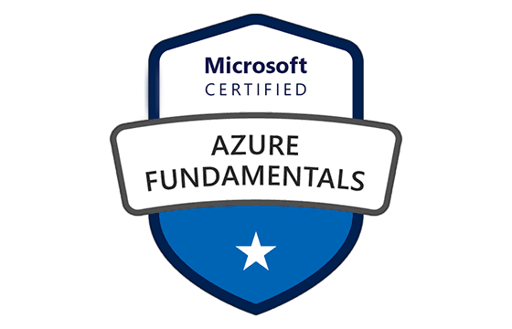

<!--
**jclizar/jclizar** is a ✨ _special_ ✨ repository because its `README.md` (this file) appears on your GitHub profile.

Here are some ideas to get you started:

- 🔭 I’m currently working on ...
- 🌱 I’m currently learning ...
- 👯 I’m looking to collaborate on ...
- 🤔 I’m looking for help with ...
- 💬 Ask me about ...
- 📫 How to reach me: ...
- 😄 Pronouns: ...
- ⚡ Fun fact: ...
-->

        
<h1> Hello! I'm Jessica 🍊 </h1>

- BSc Medical Physics
- PhD  student
- IT undergraduate student
- Love python and data science

### About me

 
 

